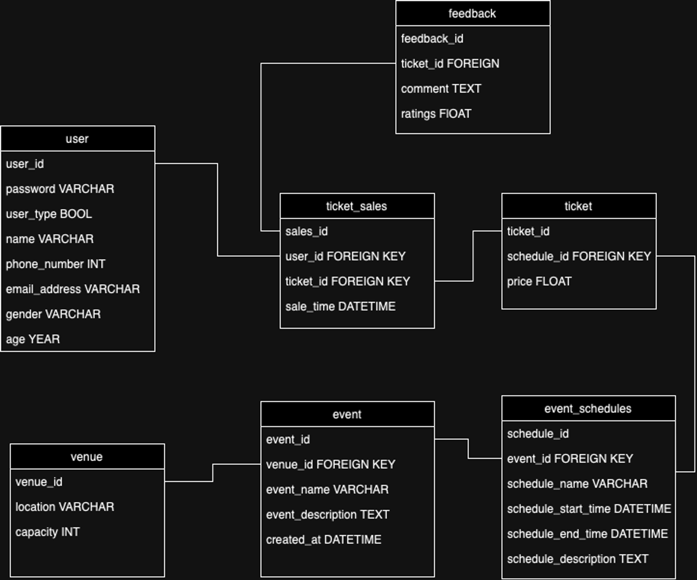
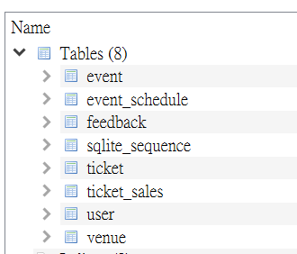

# Event Management system
## Introduction
The provided code is an event management system implemented in Python, utilizing SQLite for database operations. Below is the guide to use the system. 

## 🔧Tools
Python, SQLite, DB Browser for SQLite

## 🔑Main Menu
#### Register Account
    Name

       > Cannot be duplicated 

    Phone number 

       > Must be a 8 digit number
       
    Email

       > Format: xxx@xxx.xxx

    Gender

       > M, F, or O

    Age

       > Integer from 1 to 119

    Password

       > At least 8 positions

#### Login Account 

      Please enter :
      - Name
      - Password

## 👩🏻‍💼User Tables👨‍💼
#### Manage account
1. View Personal Account    

        Variables you can see:

        - user_id
        - password
        - user_typed
        - name
        - phone_number
        - email_address
        - gender
        - age   

2. Edit Personal Account

        Enter new value:

         - new name
         - new password:
         - new phone number
         - new email
         - new gender
         - new age

 #### Manage event
1.  View Event List

        Variable you can see: 

            - event_id
            - event_name
            - event_description
            - schedule_id
            - schedule_name
            - schedule_start_time
            - schedule_end_time
            - schedule_description
            - venue_id
            - location
            - capacity
        
 #### Manage Ticket
1. Check and Purchase ticket
          
         Things you will see when you purchase a ticket:
        
        - Available Events

        - Available Schedules and Prices
         
      
         ⚠️ Each user can buy one ticket of the same type only 
         

2. Reserve tickets

       Check the ticket you have purchased

            

3. Cancel the ticket

         Steps:

         - Enter the Ticket ID to be canceled

         Number of tickets remain can be seen afterwards

 #### Manage Feedback
1. Submit Feedback 

         Steps:

         - Choose the ticket you have purchased

         - Write your comment

         - Rate the event

2. View Feedback

         View all comments and rates

 #### EXIT THE SYSTEM
         Return to the login page <Main Menu>

## 🛠️Admin Tables🛠️

**Default admin account:**

name:123
password:123

#### Manage user
1. View user
2. Add user
3. Edit user
4. Delete user
5. Return to main menu

#### Manage event
1. View event
2. Add event
3. Edit event
4. Edit event schedule
5. Delete event
6. Return to main menu

#### Manage venue
1. View venue
2. Add venue
3. Edit venue
4. Return to main menu

#### Manage Feedback
1. View feedback
2. Add feedback
3. Edit feedback
4. Delete feedback
5. Return to main menu

#### Analyse report
1. Search Records

         - Enter user_name/ email_address
         - See the corresponding record from the USER table

2. Generate Reports

         - A sales report on the total ticket sales of all event

3. Analyze Data

         - A report on number of tickets purchased by all user

4. Export Data to CSV

         - Export the ticket_sales table as a csv file

5. Exit

#### EXIT THE SYSTEM
      Return to the login page <Main Menu>

## Schema

## DB browser

## Improvement

      ❌Data validation

      Only the registration part has the validation functions. Others are waiting to be added.

      ❌GUI

      This system does not have a GUI yet.

      ❌Massive code file

      Should be seperated into smaller file for functions and tables.